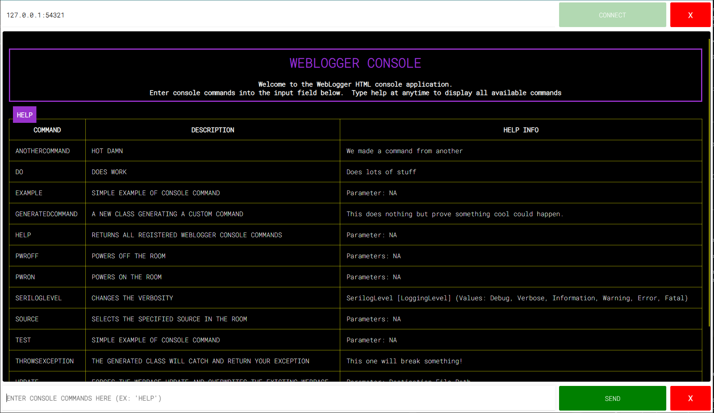

# Weblogger
 
 


WebLogger is a websocket server designed to provide an accessible console application served to an html user interface. The WebLogger library targets .netstandard 2.0 and can be used in any .net framework 4.7 and .net Core application. WebLogger will manage the server and provide an easy way to create a custom CLI using commands and prompts.
This library also includes an HTML front end using vanilla JS to handle the socket connection.
The webpage is embedded into the DLL and will be extracted when executed to a destination of your choosing.

Inspiration for this project comes from https://kielthecoder.com/2021/04/16/vc-4-websocket-sharp/.  This was original created to solve the problems described in his blog regarding Crestron's Virtual Control platform.
However it has since proven usefull in other application so a move to .netstandard was important.



## Table of Contents
1. [VS Solution](#Visual-Studio-Solution)
2. [WebLogger](#Create-a-WebLogger)
3. [Commands](#Console-Commands)
4. [Embedded HTML](#Embedded-HTML)
5. [Serilog Sink](#Serilog-Sink)
6. [Source Generators](#Source-Generators)
7. [Release Notes](#Release-Notes)

## Visual Studio Solution

The included solution includes five projects including two example projects and 4 libraries. 

- /source/`WebLogger.csproj`
- /source/`WebLogger.Serilog.csproj`
- /source/`WebLogger.Crestron.csproj`
- /source/`WebLogger.Generators.csproj`
- /example/`WebLogger.ConsoleApp.csproj`
- /example/`WebLogger.CrestronApp.csproj`

A unit test project is also included and located in the tests directory

- /tests/`WebLogger_UnitTests`

### WebLogger.csproj

This is lowest level library including all WebLogger types and logic.  This library has one dependency on WebSocketSharp

[WebSocketSharp](https://github.com/PingmanTools/websocket-sharp/)

### WebLogger.Serilog.csproj

The WebLogger.Serilog project provides a serilog sink used to write structured logging outputs to the WebLogger console.
Included in this project are the WebLogger Sink and Extension methods to streamline the configuration and implmentation.

[Serilog](https://github.com/serilog/serilog)

### WebLogger.Crestron.csproj
Adds a reference to the Crestron SDK.  This project provides some helpful Crestron commands to use with the console.
Since browsers will block ws when the html page is served via https this server solves (albeit unsecured) this issue by providing 
an unsecured http server to distribute the HTML files

### WebLogger.Generators.csproj
Provides source generators used to create commands and (other cool stuff in the future).

### WebLogger.ConsoleApp Example Program
The Weblogger example is a simple console application showing SerilogSink usage.

### WebLogger.CrestronApp Example Program
The Weblogger example is a Crestron SDK SimpleSharp program that demonstrates how to instantiate the `WebLogger` class and add console commands with callbacks.

## Create a WebLogger

To Create a new instance of the `WebLoger` class included in the `using WebLogger` namespace.  
Creating a new instace will:

1. Create a Websocket Server at the specified port
2. Copy all embedded resource HTML files to your local file system at the specified directory
3. Create a few default console commands

```csharp
using WebLogger;
```

Create a new instance and start the server using the ```WebLoggerFactory```.  The default factory method will 
return an ```IWebLogger``` interface using the default ```WebLogger``` concrete implmentation.

```csharp
var logger = WebLoggerFactory.CreateWebLogger();

```

Optionally use the Lambda ```Action<WebLoggerOptions``` to override the default parameters.
Note: Currently secured web sockets are not fully supported, options to provide a valid certificate will be provided in the next release.
https://github.com/ewilliams0305/WebLogger/issues/7

```csharp
var logger = WebLoggerFactory.CreateWebLogger(options =>
{
    options.Secured = false;  
    options.WebSocketTcpPort = 54321;                  //allows you to provide a TCP port used by the web socket server
    options.DestinationWebpageDirectory = "C:/Temp/";  //allows you to provide a file directory to extract the embedded html files.
    options.Commands = commands;                       //provide a collection of custom commands that will be registered with the console.
});

```

Call the start method to extract the embedded resources and start the web socket server at the specified port.

```csharp
logger.Start();
```

## Console Commands
Custom console commands can be created and registered with the logger, after all this is the whole point of CLI.
To get started using custom commands create a class that implements the ```IWebLoggerCommand``` interface or
using the provided ```WebLoggerCommand``` concrete class. This class has been provided for your convenience and can be used to create ADHOC commands.

### Create a Command
Define a name for the console command.  This string will be used as the command key and is what the user would enter the webpage user interface.
A friendly description and help should be provided and should be descriptive informing the user as to the function of the command.
When the WebLogger input receives a matching command key the ```CommandHandler``` will be executed.
The command handler method will provide your class the `Command` and a list of `args`.  Args will include a collection of strings that were entered into the CLI command line after the command string.

Example: enter "DO A Arg With Another Arg" would provide the handler a new `List<string>{A, Arg, With, Another, Arg}` including all values.

```csharp
internal class DoWorkCommand : IWebLoggerCommand
{
    public string Command => "DO";
    public string Description => "Does work";
    public string Help => "Does lots of stuff";
    public Func<string, List<string>, ICommandResponse> CommandHandler => DoTheWork;

    public ICommandResponse DoTheWork(string command, List<string> args)
    {
        return CommandResponse.Success(this, "Done the Work");
    }
}

```
Use the provided ```WebLoggerCommand``` class.

```csharp

var command = new ConsoleCommand(
    "EXAMPLE",
    "Simple example of console command",
    "Parameter: NA",
    (cmd, args) =>
    {
        Log.Logger.Information("{command} Received", cmd);
    });

var command = new ConsoleCommand(
    "EXAMPLE",
    "Simple example of console command",
    "Parameter: NA",
    IWebLoggerCommandHandler);
```

All command handlers must response to the WebLogger with a Success, Failure, or Error.
The ```ICommandResponse``` type can be implemented and custom responses can be provided to the WebLogger.
A default implementation is provided in the library with several factory methods.

```csharp
public ICommandResponse HandleCommand(string command, List<string> args)
{
    if (args == null || args.Count == 0)
    {
        return CommandResponse.Failure(this, "Missing File Path Parameter");
    }
    try
    {
        EmbeddedResources.ExtractEmbeddedResource(
            Assembly.GetAssembly(typeof(IAssemblyMarker)),
            ConstantValues.HtmlRoot,
            args[0]);

        return CommandResponse.Success(this, $"{args[0]}/index.html");
    }
    catch (FileLoadException fileLoadException)
    {
        CommandResponse.Error(this, fileLoadException);
    }
    catch (FileNotFoundException fileNotFoundException)
    {
        CommandResponse.Error(this, fileNotFoundException);
    }
    catch (IOException ioException)
    {
        CommandResponse.Error(this, ioException);
    }

    return CommandResponse.Error(this, new Exception("Code Unreachable"));
}

```
Responses are formatted and presented back to the WebLogger webpage with color formatted strings.
Commands with prompts will be implemented in a future release https://github.com/ewilliams0305/WebLogger/issues/8

### Register Console Commands

After creating commands, they will need to be registered with the WebLogger instance.  Programs can contain multiple WebLogger servers with different commands registered with each server.
At the simplest form execute the `IWebLogger.RegisterCommand(IWebLoggerCommand)` method.

```csharp
var logger = WebLoggerFactory.CreateWebLogger();

var command = new WebLoggerCommand(
    (cmd, args) => CommandResponse.Success("TEST", $"{cmd} Received"),
    "TEST",
    "Simple example of console command",
    "Parameter: NA")

logger.RegisterCommand(logger);

```
Commands can also be removed from the CLI at anytime.
```csharp
logger.RemoveCommand(logger);
```

Extension methods have been provided to make this easier.  If your custom command has a paramterless constructor you can execute the assembly discovery extension method to find all `IWebLoggerCommands` in the provided assembly.
```csharp
logger.DiscoverCommands(Assembly.GetAssembly(typeof(Program)))
```
An extension method to discover all the commands created inside the WebLogger library can be used as well
```csharp
logger.DiscoverProvidedCommands();
```
There is even an extension method in the Crestron implementation to discover the provided Crestron commands
```csharp
logger.DiscoverCrestronCommands();
```
An extension method to register a collection of commands has also been provided.
```csharp

var logger = WebLoggerFactory.CreateWebLogger();

var commands = new List<IWebLoggerCommand>()
{
    new WebLoggerCommand(
        (cmd, args) => CommandResponse.Success("EXAMPLE", $"{cmd} Received"),
        "EXAMPLE",
        "Simple example of console command",
        "Parameter: NA"),

    new WebLoggerCommand(
        (cmd, args) => CommandResponse.Success("TEST", $"{cmd} Received"),
        "TEST",
        "Simple example of console command",
        "Parameter: NA")
};

logger.RegisterCommands(commands);
```

## Embedded HTML

Located in the `WebLogger` project is a folder titled `HTML`.  All HTML source files have been added to the project and configured as an embedded resource.  
These files will be automatically extracted and written to the provided `applicationDirectory` in the WebLoggerFactory's CreateWebLogger() method.

```csharp 
var logger = WebLoggerFactory.CreateWebLogger(options =>
{
    options.DestinationWebpageDirectory = "C:/Temp/";
});
```
Be aware, the program will check if the files are already created and **ONLY write them if they are not found**. 
This decision was made to reduce disc writes and ensure files are recreated every time the application is restarted
This means the HTML files will need to be deleted off the server if changes to the HTML are made.
After starting the WebLogger, a directory will be created at the specifed location with the following file tree

- index.html
- console.js
- style.css

To help with writing webpage updates a custom command is provided by the ```IWebLogger.DiscoverProvidedCommands();```
extension method.  Execute this command and your weblogger will be provided with an `Update` command.  All files will be extracted from the embedded resources and written to the specified file directory.

```

COMMAND............... | HELP........................................................  
> UPDATE.............. | FORCES THE WEBPAGE UPDATE AND OVERWRITES THE EXISTING WEBPAGE | Parameter: Destination File Path | 
> HELP................ | RETURNS ALL REGISTERED WEBLOGGER CONSOLE COMMANDS | Parameter: NA | 
> IPCONFIG............ | DISPLAYS THE IP CONFIGURATION........... | Not parameters | 

HELP>Help End

update /opt/crestron/virtualcontrol/RunningPrograms/TEST/Html/logger/

UPDATE>/opt/crestron/virtualcontrol/RunningPrograms/TEST/Html/logger//index.html

```

When using the WebLogger.Crestron library you can create a custom http file server and distibute the HTML page via an unsecured webserver

```csharp

Log.Logger = new LoggerConfiguration()
    .MinimumLevel.Verbose()
    .WriteTo.WebloggerSink(
        options =>
        {
            options.Commands = commands;
            options.Secured = false;
            options.DestinationWebpageDirectory = Path.Combine(Directory.GetApplicationRootDirectory(), "html/logger");
            options.WebSocketTcpPort = 54321;
        },
        logger =>
        {
            logger
                .ServeWebLoggerHtml(8081)
                .DiscoverCrestronCommands();

        })
    .CreateLogger();

```

The above code will result in a url http://ip:8081/index.html 
While the files will be stored in the application directory /html/logger/

## Serilog Sink
The WebLogger.Serilog library provides a Serilog Sink used to write structured logs to the WebLogger websocket output.
Generally speaking, this is really intended for verbose information as the WebLogger does not store data.  Logs should be writen to additional Sinks for permanent storage.
Start by creating a `LoggerConfiguration` and `WriteTo` the `WebLoggerSink`.

```csharp
Log.Logger = new LoggerConfiguration()
    .MinimumLevel.Verbose()
    .WriteTo.WebloggerSink()
    .CreateLogger();
```
Invoking the `WriteTo.WebLoggerSink()` method will create a weblogger server and start the services with default `WebLoggerOptions`.
To further customize you configuration implement the `Action<WebLoggerOptions>` lambda and update the properties to meet your configuration needs.

```csharp

Log.Logger = new LoggerConfiguration()
    .MinimumLevel.Verbose()
    .WriteTo.WebloggerSink(
        options =>
        {
            options.Commands = commands;
            options.Secured = false;
            options.DestinationWebpageDirectory = "C:/Temp/WebLogger/Logger";
            options.WebSocketTcpPort = 54321;
        }
    .CreateLogger();

```
Since the Sink is now resonsible for creation of the WebLogger and your application no longer has a reference to the logger an optional 
`Action<IWebLogger>` has been provided.  This provides you a reference to the WebLogger and allows for further command registration and management.

```csharp
Log.Logger = new LoggerConfiguration()
    .MinimumLevel.Verbose()
    .WriteTo.WebloggerSink(
        options =>
        {
            options.Commands = commands;
            options.Secured = false;
            options.DestinationWebpageDirectory = "C:/Temp/WebLogger/Logger";
            options.WebSocketTcpPort = 54321;
        },
        logger =>
        {
            logger.DiscoverCommands(Assembly.GetAssembly(typeof(Program)))
                .DiscoverProvidedCommands();
        })
    .CreateLogger();
```
If you need to, store a referance to the logger, but NOTE `Log.CloseAndFlush()` will dispose the `WebLogger` and could create upstream issues with your application depending on the usage.
```csharp
IWebLogger webLogger;

Log.Logger = new LoggerConfiguration()
    .MinimumLevel.Verbose()
    .WriteTo.WebloggerSink(logger => webLogger = logger;)
    .CreateLogger();

webLogger
    .DiscoverCommands(Assembly.GetAssembly(typeof(Program)))
    .DiscoverProvidedCommands();

```

## Source Generators

A source generator analyzer project has now been created and is included in the solution.  This is my first shot at these so be kind!
The project `WebLogger.Generators` includes a source generator used to discover and create `IWebLoggerCommands`.  To get started using
the source generators add the `WebLogger.Generators.nupkg` to your project.

Note: As of 1.1.3 Generators now use IIncrementalGenerator interface and only generate output when the the Argumnets change on you method attributes!

```xml
<ProjectReference Include="..\..\source\WebLogger.Generators\WebLogger.Generators.csproj" />
```
After adding the package the `CommandHandlerAttribute` will be generated and added to your project in the CommandHandlerAttribute.g.cs file.

```csharp
// <auto-generated/>

namespace WebLogger.Generators
{
    [global::System.AttributeUsage(global::System.AttributeTargets.Method, AllowMultiple = false)]
    public class CommandHandlerAttribute : global::System.Attribute
    { 
        //...
    }
}
```
Create a new partial class including one method with the `ICommandHandler` method signature. Note that you can apply this attribute
to any method on your class however once the generator starts expands your class you will get compilation errors informing you the method doesn't match.

```csharp

using WebLogger.Generators;

namespace WebLogger.ConsoleApp.GeneratedCommands
{
    public partial class GeneratedCommand
    {

        [CommandHandler(
            "Generated Command",
            "A new class generating a custom command",
            "This does nothing but prove something cool could happen.")]
        public ICommandResponse ExecutedMethod(string command, List<string> args)
        {
            return CommandResponse.Success(command, "WOW, something cool just happened.");
        }
    }
}

```

The generated code behind the scenes will create partial class implmenting the `IWebLoggerCommand` interface.  All the defined attribute parameters will be 
automatically married to the interfaces properties.  See generated code:

```csharp
namespace WebLogger.ConsoleApp.GeneratedCommands
{
    public partial class GeneratedCommand : IWebLoggerCommand
    {
        public string Command => "GENERATEDCOMMAND";
        public string Description => "A new class generating a custom command";
        public string Help => "This does nothing but prove something cool could happen.";
        public Func<string, List<string>, ICommandResponse> CommandHandler => ExecuteCommand;

        protected ICommandResponse ExecuteCommand(string command, List<string> args)
        {
            try
            {
                return ExecutedMethod(this.Command, args);
            }
            catch (Exception e)
            {
                return CommandResponse.Error(this, e);
            }
        }
    }
}
```

Your class can now be registered like any other command.  Assuming there is a paremater-less constructor the command will even be automatically discovered with the extension methods listed above.
If your class is far more complex you can instantiate it and register the instance with a WebLogger

```csharp
logger.DiscoverCommands(Assembly.GetAssembly(typeof(Program)))
                .DiscoverProvidedCommands();

// Or create a new instance and register.

logger.RegisterCommand(new GeneratedCommand());
```

There are still a *few open issues* that could really improve this.  
- Attribute parameters must be string literals, using `nameof(Blah)` for example will throw an exception during generation.

The example console application includes a folder with (4) example generated commands.

## Release Notes

#### Version 1.1.3
- Moved to inremental source generator
- Source generator now creates the CommandHandleAttribute as such this is no longer included in the WebLogger assembly.
- Source generator now handles top level namespace declarations.

#### Version 1.1.2
- Created source generator library to automatically create web logger commands
- Created Crestron SIMPL windows support.  There are now two SPLUS modules used for the server and commands.
- Commands can now be executed with a partial match and properly reject emty strings

#### Version 1.1.0
- Changed command handler from ```Action<string, List<string>``` to ```Func<string, List<string>, CommandResponse``` 
to provide a command response.  Returned string will now be Written to the webLogger output.
- Created ```WebLogger.Serilog``` Project and Nuget Package.  This allowed the web logger to remove the dependency on Serilog.
Weblogger.Serilog now provides logger configuration extensions and SerilogSink for the weblogger server.
- Provided `Action<IWebLogger>` to the WebLoggerFactory
- Created extension methods to discovery all defined commands in a provided assembly. 
- Commands are now partially matched and will execute the first found command. i.e. type `up` to execute `update` 

#### Version 1.0.1
- Initial Release


